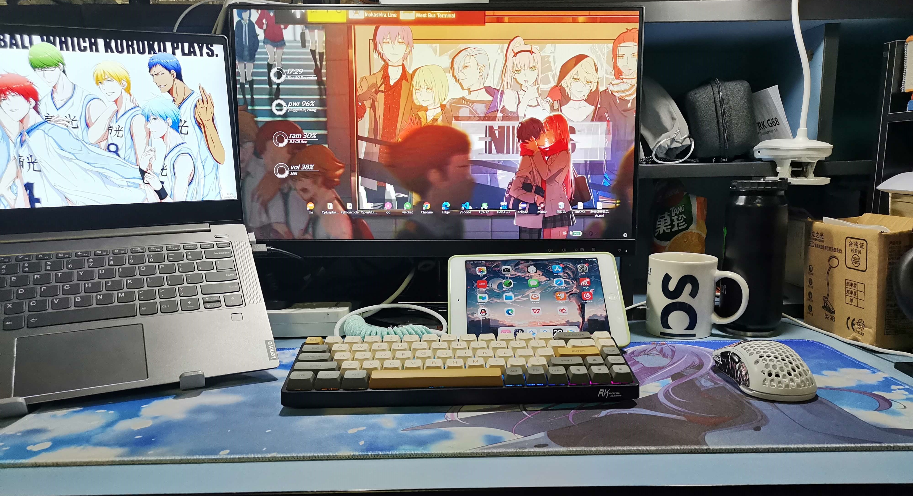

    

     
     
咯咯咯咯哒🥚

     <h4 align="center">pengpenglangの作業壁</h2>
     
👋呕吼❗欢迎来到pengpenglang的作业墙😀

    

      

        
        
        
         
         
        
    
  

- 📧**致短暂的大学Tim**：这里记录了pengpenglang从小白踏入CS门槛敲过的所有bug😋
- **🔔致点到这的小可爱**：大学生活的时间里唯有敲代码的日日夜夜是难忘而美好的🎉
- 📢 **你知道什么时候会赢吗**：就是往前奔跑。黑夜中你知道什么时候会天亮吗？跑着跑着就天亮了 🏃

